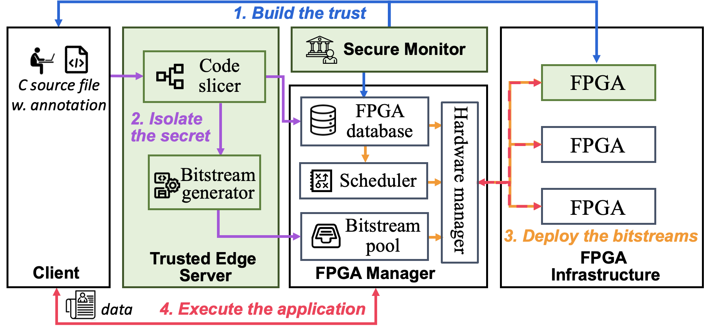

# DF-TEE: Trusted Execution Environment for Disaggregated Multi-FPGA Cloud Systems
This is a preliminary version of the source code for DF-TEE based on our AsianHost paper. To find more details, please read our [paper](./docs/AsianHost23_DF-TEE.pdf): 

Ke Xia and Sheng Wei, "DF-TEE: Trusted Execution Environment for Disaggregated Multi-FPGA Cloud Systems", Asian Hardware Oriented Security and Trust Symposium (AsianHOST), 2023

# System Overview

The system is divided into five components:
- **Client** supports SGX and wishes to offload computation to FPGA.
- **Trusted edge server** slices the client source code into untrusted and trusted functions, and compiles the code into FPGA bitstreams.
- **FPGA manager** communicates with the FPGAs to execute the computation.
- **FPGAs** are the hardwares to run the compiled workload.

# Execution Instructions
## Client
We leverage the SGX remote attestation example to attest with the secure monitor. Please see: [SGX-ra-sample](https://github.com/intel/sgx-ra-sample).
The folder `benchmark` includes the benchmark code. To run the code, please put the selected .c file into the trusted edge server.

## Trusted edge server
- Install [TaintGrind(v.3.12.0)](https://github.com/wmkhoo/taintgrind) 
- Download the code for [TZSlicer](https://github.com/hwsel/tzslicer) and add it to the folder `code/trusted_edge_server`
- Execute:
```
gcc -I ./valgrind/valgrind-3.12.0/taintgrind/ -I ./valgrind/valgrind-3.12.0/include/ -g $c_source_file -o $compiled_c_object -lm
./valgrind/valgrind-3.12.0/build/bin/valgrind --tool=taintgrind $compiled_c_object 2>$log_file
python Main.py $compiled_c_object 0 0 0 0
python slicer.py
```
The compiled code is tested with Xilinx Vitis 2022.1.

## FPGAs and the FPGA manager
The provided code is based for the benchmark gamma_filter. To run the compiled workload, execute the files separately:
```
FPGA_manager/FPGA_manager.ipynb
FPGA/FPGA_1.ipynb
FPGA/FPGA_2.ipynb
```
